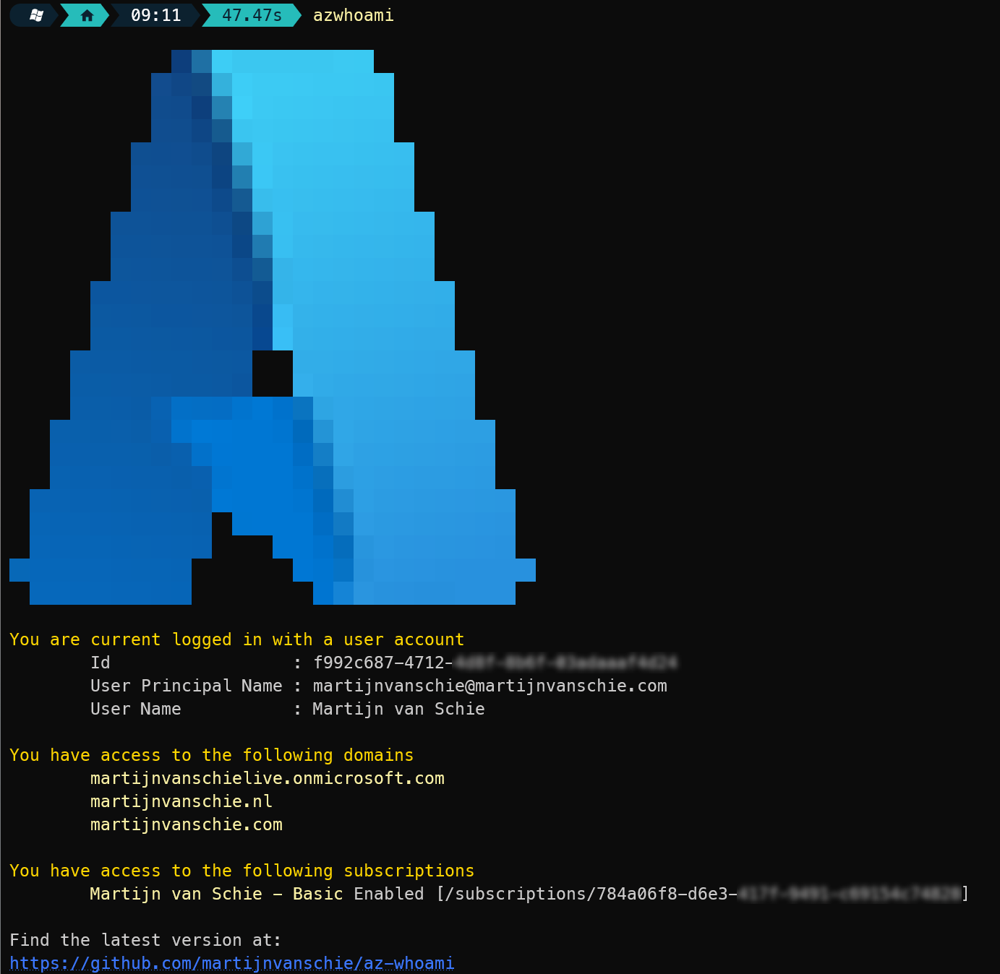

# Azure Who Am I

## What does it do

Azure Who Am I is a small wrapper around various Azure CLI (`az`) command which give information about your current logged in account for Azure CLI.

## Prerequisites

**Azure CLI**  
Download the CLI from the download page [Azure Command-Line Interface](https://learn.microsoft.com/en-us/cli/azure/)

**.Net 7.0**  
The code is running on .Net 7.0 which can be downloaded here at [.NET 7.0 SDK](https://dotnet.microsoft.com/en-us/download/dotnet/thank-you/sdk-7.0.100-windows-x64-installer) download site.

**Azure CLI account extension**  
`az extension add --name account`

## Installation

Just download the executable from the [releases](https://github.com/martijnvanschie/az-whoami/releases) page. Put in a (shared) folder and add the folder to your PATH variable. Then just run `azwhoami`.

Currently only a preview version is available which is a win-64 release build. 

**Note:** `azwhoami` required .Net 7 to be installed on your machine. It also works with Azure CLI which ofcourse is also required.

## So waht do i get

The command line will print various kinds of information related to your account. Depending on your account type (user|service principal) you will get other information.

Below is an example of my user account which i used for work :)

